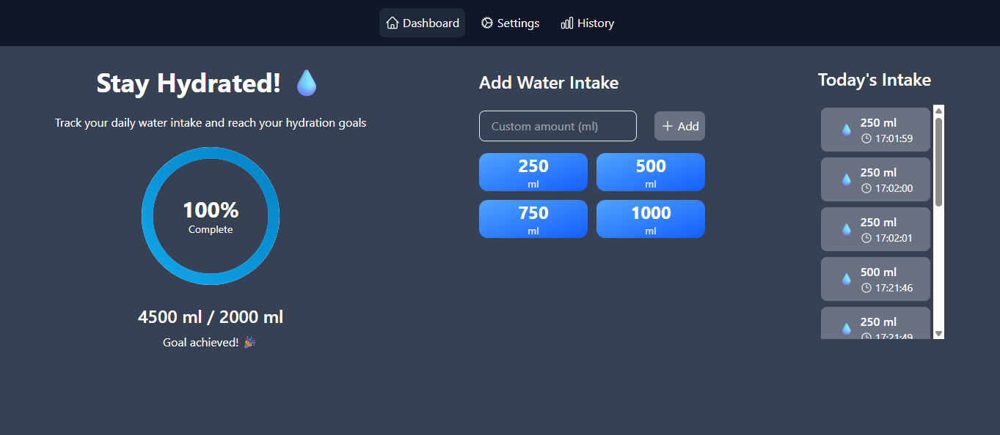
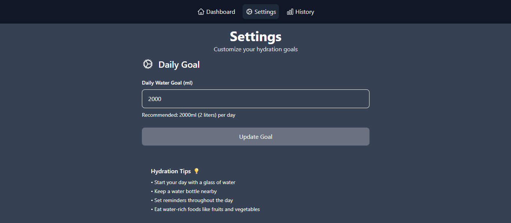
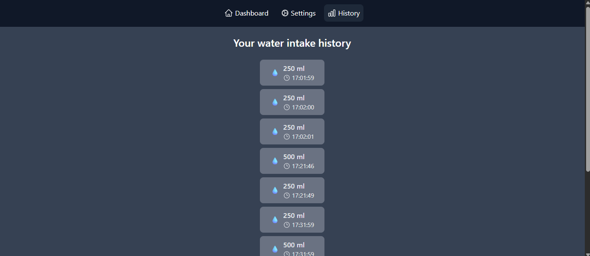

# Water Intake Tracker

A full-stack water intake tracking application built with the MERN stack (MongoDB, Express, React, Node.js). This application helps users monitor their daily water consumption, set hydration goals, and maintain healthy drinking habits.

## Table of Contents

-   [Features](#features)
-   [Technologies Used](#Technologies-Used)
-   [Screenshots](#screenshots)
-   [Installation](#installation)

## Features

The main features and functionalities of Hydration Tracker are:

-   Water Intake Tracking: Allows users to log their water consumption in real-time with custom amounts.
-   Daily Goal Setting: Users can set and update their daily water intake goals.
-   Visual Progress: Displays a circular progress indicator showing percentage of daily goal achieved.
-   Intake History: Records and displays a history of water consumption entries.
-   Quick Add Options: Provides preset amounts (250ml, 500ml, 750ml, 1000ml) for quick logging.
-   Local Storage: Stores water intake data locally for persistent tracking between sessions.
-   Responsive UI: The user interface adapts to different screen sizes, providing a seamless experience on desktop, tablet, and mobile devices.

## Technologies Used

-   **Frontend:** React.js
-   **Backend:** Node.js with Express.js
-   **Database:** MongoDB
-   **Routing:** React Router
-   **HTTP Client:** Axios
-   **UI Components:** Heroicons

## Screenshots

**Sign Up and Sign In**

## Installation

To run the project locally, follow these steps:

1. **Clone the Repository:** `git clone https://github.com/anandprakash01/task-assignment-fullstack-internship-metafic.git`.

2. **Backend/Server Setup:**

    - Navigate to the project directory: `cd task-assignment-fullstack-internship-metafic`.
    - Create a .env file in the server directory and add your environment variables (such as MongoDB URI, JWT secret key, etc.)
    - Install dependencies: `npm install`.

3. **Frontend/Client Setup (React):**

    - Navigate to client in the project directory: `cd task-assignment-fullstack-internship-metafic/client`.
    - Install dependencies: `npm install`.

4. **Running the Application:**
    - Start the backend/server: `npm start`.
    - Start the frontend/client: `npm run dev`.

Good luck with your project! 🚀
